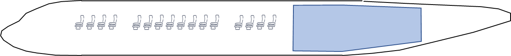

Use case: an hydrogen powered turbofan
======================================

.. note::

    This study case is kindly provided
    by `Thierry Druot <https://cv.archives-ouvertes.fr/thierry-druot>`_,
    Pre-Project Research Engineer at `Airbus <https://www.airbus.com/>`_,
    seconded to `ENAC <https://www.enac.fr/en>`_.
    The authors of this practice are very grateful to him.
    Thanks, Thierry!

The context of the study
------------------------

Hydrogen is a candidate to replace kerosene for future airplanes
because it does not emit carbon dioxide when burning.

The aim of this study is to evaluate the impact of the use of liquid hydrogen
in place of kerosene on the design and performances of a turbofan airplane.

The type of airplane targeted
-----------------------------

The type of airplane in the focus of this study corresponds to an A320.
We suppose that we want to redesign an airplane
with the same set of requirements than the classical kerosene A320
but powered with liquid hydrogen.

The problems with liquid hydrogen
*********************************

Liquid hydrogen (LH2) has three main drawbacks
in comparison to kerosene as soon as airborne storage is needed :

#. The very low temperature of LH2 (~20Kelvin, -253°C) requires very specific fuel system
   to take it from the tank and feed the engine at ambient temperature.
#. The volume of the tank is about 4 time bigger than with kerosene
   for an equivalent amount of internal energy.
#. The weight of tank is important due the necessary high level of insulation.

Point 1 is out of the scope of this study
but we will treat points 2 and 3
that are linked to the level of maturity of liquid hydrogen storing technology.

The technological evolutions
****************************

The technological level of LH2 tanking system is classically characterized
by two indices :

* The gravimetric index = (LH2_mass)/(LH2_mass+Tank_mass)
  quantifies the efficiency of the tank to store LH2 in terms of mass.
* The volumetric index = (LH2_volume)/(LH2_volume+Tank_volume)
  quantifies the efficiency of the tank to store LH2 in terms of volume.

The technology is expected to evolve in the coming years,
following values are commonly accepted :

.. list-table::
   :header-rows: 1

   * -
     - State of the art 2021
     - Status 2030
   * - Gravimetric index
     - 0.1
     - 0.3
   * - Volumetric index
     - 0.606
     - 0.845

The simplest way to store a huge volume of LH2 in the aircraft is probably
to put the tank in the rear fuselage.
This implies to share the available length
inside the fuselage between passengers and LH2 tank.
Anyway,
acceptable performances cannot be achieved
without lengthening the fuselage of the kerosene airplane.

   LH2 tank in the rear fuselage.

For several reasons,
fuselage length cannot be stretched beyond a certain limit.
In this study,
we will use a maximum value for the ratio (fuselage_length)/(fuselage_diameter)
to limit the length of the fuselage.
This maximum value will be taken from the A340-600
which is considered has an extreme regarding this ratio.

Achieve the performances of the A320
************************************

The classical kerosene A320 has the following general characteristics and performances:

* Nominal seat capacity = 150 pax (passengers)
* Nominal range = 3000 NM (1 Nautical Mile = 1852 m)
* Cruise speed = Mach 0.78
* Maximum Take Off Weight (MTOW) = 77000 kg
* Maximum Landing Weight (MLW) = 65000 kg

* Engine maximum thrust = 120 kN (103 Newtons)
* Engine Bypass Ratio (BPR) = 9 (ratio of cold flow over hot flow for a turbofan)
* Wing area = 122 m²
* Wing aspect ratio = 9  (wing_span² / wing_area)

* Fuselage aspect ratio = 11.0  (fuselage_length / fuselage_height, maximum is 13.4)
* Maximum Take Off Field Length (TOFL) sea level, temperature ISA+15, MTOW = 2200 m
* Maximum Approach speed sea level, temperature ISA, MLW = 137 kt (1 knots = 1.852 km/h)
* Minimum Vertical speed Top Of Climb (TOC), 97% MTOW, cruise speed, ISA, Max Climb Rating (MCL) = 300 ft/min (1 m/s = 197 ft/min)
* Minimum Vertical speed Top Of Climb (TOC), 97% MTOW, cruise speed, ISA, Max Cruise Rating (MCR) = 0 ft/min (1 m/s = 197 ft/min)
* One engine inoperative minimum climb path, 97% MTOW, ISA, Maxi Continuous Rating (MCN) = 1.1%
* Maximum Time To Climb to cruise altitude, Maxi Climb Rating (MCL) = 25 min

.. figure:: _static/use_case/n2pac_2.png
   :width: 75%

   Side, top and front view of the A320-200neo.

Preliminary studies have shown
that a range of 3000 NM could not be achieved
with 150 passengers on board with hydrogen as fuel.
Number of passengers or range (or both) must be reduced.
After having discussed with Marketing team,
engineers have chosen to keep the passenger capacity and reduce the range to 1800 NM.

It is assumed that about ten years will be necessary to develop and certify
such a full liquid hydrogen powered aircraft
so **2030 technological level will be assumed**.
It is supposed that the use of hydrogen have no significant impact
on the engine characteristics and performances.

Find the hydrogen powered A320-like aircraft
********************************************

The problem is now to find the “best” hydrogen powered airplane design
that satisfies the same operational constraints as the kerosene A320
(except for the range).
The existing know how in terms of airplane design has shown
that the Maximum Take Off Weight (MTOW) of the airplane is a good criterion
to optimize a design.

The design problem
------------------

The design problem can be summarized as follows :

Find values for the **Design Parameters** that minimize the **Criterion**
whilst satisfying **Operational Constraints**.

**Criterion** is: MTOW

**Design Parameters** are :

* Engine maximum thrust  (100 kN ≤ thrust ≤ 150 kN)
* Engine Bypass Ratio  (BPR)  (5 ≤ BPR ≤ 12 )
* Wing area  (120 m² ≤ area ≤ 200 m²)
* Wing aspect ratio  (7 ≤ ar ≤ 12)

**Operational Constraints** are :

* Take Off Field Length (TOFL ≤ 2200 m)
* Approach speed (VAPP ≤ 137 kt)
* Vertical speed MCL rating  (300 ft/min ≤ VZ_MCL)
* Vertical MCR rating  (0ft/min ≤ VZ_MCR)
* One engine inoperative climb path  (1.1% ≤ OEI_PATH)
* Time To Climb to cruise altitude  (TTC ≤ 25 min)
* Fuselage Aspect Ratio  (FAR ≤ 13.4)

In addition to this,
several **Technological Parameters** need to be taken into account:

#. Tank gravimetric index = 0.3,
   with uncertainty: Triangular(0.25, 0.3, 0.305)
#. Tank volumetric index = 0.845,
   with uncertainty: Triangular(0.8, 0.845, 085)
#. Aerodynamic efficiency factor = 1.,
   with uncertainty: Triangular(0.99, 1., 1.03)
#. Propulsion efficiency factor = 1.,
   with uncertainty: Triangular(0.99, 1., 1.03)
#. Structure efficiency factor = 1.,
   with uncertainty: Triangular(0.99, 1., 1.03)

where Triangular(:math:`a`, :math:`b`, :math:`c`) represents
the `triangular distribution <https://en.wikipedia.org/wiki/Triangular_distribution>`_
with lower limit :math:`a`, mode :math:`d` and upper limit :math:`c`.
These probability distributions are not symmetrical
as it is always easier to make something less efficient than expected...

.. note::

   The involved factors are defined
   so that a low value is better than a high one.

Points 3, 4 and 5 are related
to the three main technical areas involved in aircraft design,
Aerodynamics, Propulsion and Structural design.
Presented factors are representing the part of indetermination
that relies in any creative activity.

The numerical simulator
-----------------------

To solve the problem,
a Python function is provided to compute the criterion
and the operational data from the design and technological parameters.

The Python function
*******************

This function packages a dedicated Python script
which is an application of `MARILib <https://github.com/marilib/MARILib_obj>`_
(Multidisciplinary Airplane Research Integrated Library)
developed at `ENAC <https://www.enac.fr/en>`_
to support Airplane Conceptual Design Teaching and some research activities [1]_.

.. [1] Thierry Druot, Mathieu Belleville, Pascal Roches, François Gallard, Nicolas Peteilh, et al. A Multidisciplinary Airplane Research Integrated Library With Applications To Partial Turboelectric Propulsion. *AIAA Aviation 2019 Forum*, Jun 2019, Dallas, United States. `⟨hal-02160977⟩ <https://hal-enac.archives-ouvertes.fr/hal-02160977>`_

The signature of the Python function is:

.. code::

   data = fct_turbofan_h2(techno, design, mode)

where :code:`data`, :code:`techno`, :code:`design` and :code:`mode`
are Python dictionaries defined below:

.. code::python

    data = {
            "mtow": mtow, # (kg) Maximum Take Off Weight
            "fuel": fuel_block, # (kg) Specific mission fuel
            "coc":  cash_op_cost, # ($/trip) Specific mission Cash Operating Cost
            "tofl": tofl, # (m) Take Off Field Length
            "vapp": app_speed, # (m/s) Approach speed
            "vz_mcl": vz_mcl, # (m/s) Vertical speed in MCL rating
            "vz_mcr": vz_mcr, # (m/s) Vertical speed in MCR rating
            "oei_path": oei_path, # (rad) Air path with one engine inoperative
            "ttc": ttc, # (s) Time To Climb
            "far": far # () Fuselage aspect ratio
            }

.. note::

   :code:`"fuel_block"` and :code:`"cash_operating_cost"` are outputs
   that can be used as criterion for the optimization.

.. code::

    techno = {
        "drag": 1.0, # Aerodynamic efficiency factor
        "sfc": 1.0, # Propulsion efficiency factor
        "mass": 1.0, # Structure efficiency factor
        "tvi": 0.845, # Tank volumetric index
        "tgi": 0.3, # Tank gravimetric index
    }

    design = {
        "thrust": unit.N_kN(121), # (N) Engine maximum thrust
        "bpr": 9, # () Engine Bypass Ratio
        "area": 164, # (m2) Wing area
        "aspect_ratio": 9 # () Wing aspect ratio
    }

    mode = "eval" # Configuration, Can be "eval", "draw", "plr", "ds".

The different values for mode have the following effects :

* :code:`"eval"`: only data is provided as output
* :code:`"draw"`: a small 3 view drawing of the airplane is displayed
* :code:`"plr"`: a Payload vs Range diagram is displayed
* :code:`"ds"`: a graphical analysis of the design space around the provided point is displayed

Unit conversion
***************

.. warning::

    The function only knows STANDARD UNITS which means
    that all data provided to the function MUST be expressed in standard units
    and that all data retrieved by the function are expressed in standard units.

Used standard units are:

.. list-table::
   :header-rows: 1

   * - Standard unit
     - Symbol
   * - meter
     - m
   * - square meter
     - m2
   * - kilogram
     - kg
   * - second
     - s
   * - meter per second
     - m/s
   * - nots
     - kt
   * - Newton
     - N
   * - Dollar
     - $

Usual units are:

.. list-table::
   :header-rows: 1

   * - Usual unit
     - Symbol
   * - minute
     - min
   * - feet
     - ft
   * - feet per minute
     - ft/min
   * - knot
     - kt

One may use specific converters provided by MARILib in the module **unit**
to play between the units.

The syntax of the converters is: :code:`[target_unit]_[initial_unit](value)`.

Required converters for the study are:

- :code:`ftpmin_mps()`,
- :code:`mps_ftpmin()`,
- :code:`kt_mps()`,
- :code:`mps_kt()`,
- :code:`N_kN()`,
- :code:`kN_N()`,
- :code:`s_min()`,
- :code:`min_s()`.

The function :code:`print_data(data)` is provided
to display the content of the data dictionary rounded in usual units.

You can access these functions through aliases

.. code::python

   from h2_turbofan import evaluate_model, print_model

   output_data = evaluate_model(techno, design, "eval")
   print_model(techno, design, output_data)

Start with GEMSEO
-----------------

The first stage of this project will be
to create a class **H2TurboFan** inheriting from **MDODiscipline**
by overloading the methods:

- **__init__**: this method defines the names of the inputs and outputs
  as well as the default values of the inputs,
- **_run**: this method defines the way as output data are compute from input data,
  it reads the input data from the dictionary ``MDODiscipline.local_data``
  and store the data in this dictionary.

.. warning::

   GEMSEO considers input and output data of the form
   ``{name_1: value_1, ..., name_d: value_d}``
   where ``name_i`` is the name of the i-the variable
   and ``value_i`` is its value expressed as a 1D NumPy array.

.. note::

   You can override the method **__repr__** to make your instances of **H2TurboFan** printable:

   .. code::python

      model = H2TurboFan()
      model.execute() # or execute({'input_name': array_value, ...})
      print(repr(model))

   .. code::

        H2TurboFan
           Inputs: area, aspect_ratio, bpr, drag, mass, sfc, tgi, thrust, tvi
           Outputs: coc, far, fuel, mtow, oei_path, tofl, ttc, vapp, vz_mcl, vz_mcr
        ---------------------------------------------------------------------------
        Drag factor =    1.000 (0.99 =< kcx =< 1.03)
        SFC factor =    1.000 (0.99 =< ksfc =< 1.03)
        Mass factor =    1.000 (0.99 =< kmass =< 1.03)
        Tank Volumetric Index =    0.845 m3-LH2 / m3-(LH2+Tank), (0.6 =< vi =< 0.85)
        Tank Gravimetric Index =    0.300 kg-LH2 / kg-(LH2+Tank), (0.25 =< gi =< 0.305)

        Reference thrust =    125.0 kN, (100 =< thrust =< 150)
        By Pass Ratio =      8.5 (5 =< bpr =< 12)
        Reference area =    160.0 m2, (120 =< area =< 200)
        Aspect ratio =      9.5 (7 =< ar =< 12)
        ---------------------------------------------------------------------------
        Criterion, Max Take Off Weight =  84264.9 kg
        Criterion, Cost mission fuel block =    994.7 kg
        Criterion, Cash Operating Cost =   5790.2 $/trip

        Constraint, Take Off Field Length =   2144.2 m (must be =< 2200 m)
        Constraint, Approach speed =    137.3 kt (must be =< 137 kt)
        Constraint, Vertical speed, MCL rating, TOC =   1089.1 ft/min (must be >= 300 ft/min)
        Constraint, Vertical speed, MCR rating, TOC =    219.3 ft/min (must be >= 300 ft/min)
        Constraint, One Engine Inoperative climb path =     1.70 % (must be >= 1.1%)
        Constraint, Time To Climb =     18.2 min (must be =< 25 min)
        Constraint, fuselage aspect ratio =   13.143 (must be =< 13.4)